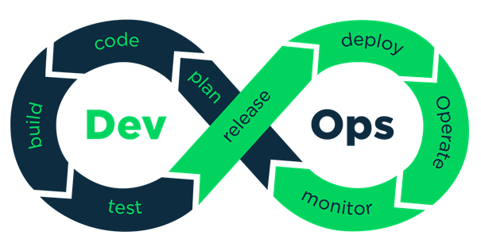

# What is DevOps?

DevOps is a set of practices, principles, and cultural philosophies that aim to bridge the gap between software development (Dev) and IT operations (Ops). It focuses on enhancing collaboration, automation, and continuous integration and deployment (CI/CD) to improve software delivery speed, quality, and reliability. 

## Key Objectives of DevOps
- **Faster Time to Market**: Reduce the time taken from development to deployment.
- **Improved Collaboration**: Eliminate silos between teams.
- **Automation**: Automate repetitive tasks to increase efficiency.
- **Continuous Integration & Continuous Deployment (CI/CD)**: Enable rapid and reliable software releases.
- **Monitoring & Feedback**: Provide real-time feedback for continuous improvement.

# DevOps Steps
DevOps follows a continuous cycle of phases to ensure smooth software development and deployment. The key steps in the DevOps lifecycle are:

## 1. **Plan**
- Define project requirements, objectives, and goals.
- Establish clear development strategies and workflows.
- Ensure alignment between teams by setting expectations and priorities.

## 2. **Develop**
- Write, review, and improve code collaboratively.
- Follow best practices to ensure code quality and maintainability.
- Encourage version control to track changes and improvements.

## 3. **Build**
- Convert source code into executable applications or artifacts.
- Validate dependencies and ensure consistency across environments.
- Prepare code for further testing and deployment.

## 4. **Test**
- Verify the functionality, security, and performance of the application.
- Identify and fix defects early in the development cycle.
- Ensure reliability and stability before deployment.

## 5. **Release**
- Package and prepare the application for deployment.
- Ensure that configurations and dependencies are correctly set.
- Make sure the release process is controlled and predictable.

## 6. **Deploy**
- Move the application to production or staging environments.
- Minimize downtime and risk during deployment.
- Ensure rollback mechanisms are in place for failed deployments.

## 7. **Operate**
- Manage and maintain application performance.
- Ensure system reliability, availability, and scalability.
- Address operational challenges such as resource management and security.

## 8. **Monitor**
- Continuously observe system health, performance, and logs.
- Detect anomalies and potential issues before they impact users.
- Gather insights to improve system efficiency and reliability.

## 9. **Feedback and Improve**
- Collect feedback from users and system monitoring.
- Identify areas for improvement and implement necessary changes.
- Foster a culture of continuous learning and process refinement.

By implementing DevOps best practices, organizations can achieve faster software delivery cycles, higher stability, and improved collaboration between teams.

## DevOps Lifecycle Visual Representation

